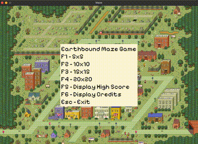

# Maze Game

This is a maze game with guaranteed, procedurally generated paths from one corner of the map to the other. There are four map sizes in this game: 5x5, 10x10, 15x15, and 20x20. You can also click "B" during a game to view the breadcrumbs of spots you have already visted, and "P" to see the correct path you should be taking if you get stuck. Aim for the highest score possible!

  

## Set up
1. Ensure C#/.NET, MonoGame, and this project is installed
2. Navigate to the 'Maze' directory and run 'dotnet build' and 'dotnet run'. 

